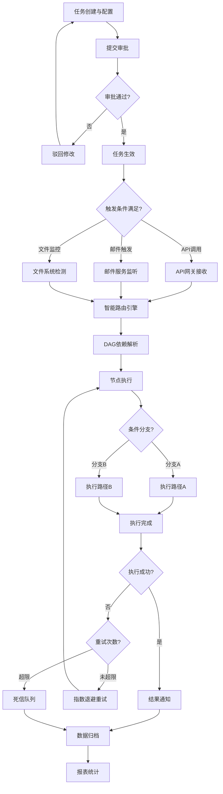
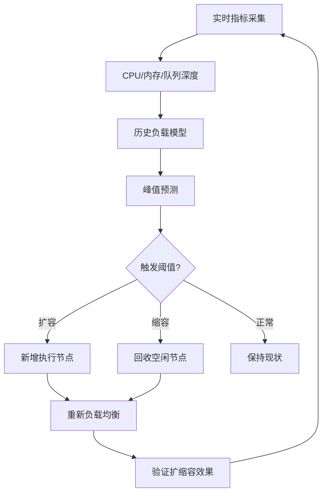

## 1. 产品概述

面向大型企业的自动化任务调度与资源管理平台，解决企业级复杂任务编排、资源优化分配、多团队协作的核心痛点。通过智能化调度引擎、可视化流程编排、精细化权限控制，帮助企业提升任务执行效率、降低运营成本、保障系统稳定性。

- 核心价值：统一任务入口、智能资源调度、可视化流程管理、全链路可追溯
- 目标用户：企业IT运维团队、数据开发团队、业务流程管理团队、系统管理员

## 2. 核心功能

### 2.1 用户角色

| 角色 | 注册方式 | 核心权限 |
|------|----------|----------|
| 系统管理员 | 系统初始化创建 | 租户管理、全局配置、系统监控、审计日志 |
| 租户管理员 | 系统管理员创建 | 租户资源配置、用户管理、审批链配置、调度策略 |
| 项目负责人 | 租户管理员创建 | 项目管理、任务编排、资源分配、报表查看 |
| 开发人员 | 项目负责人邀请 | 任务开发、测试运行、日志查看、依赖配置 |
| 审批人员 | 租户管理员授权 | 任务审批、转交、驳回、意见填写 |
| 普通用户 | 自助注册/管理员创建 | 任务查看、运行历史、个人报表 |

### 2.2 功能模块

1. **总览仪表盘**：关键指标概览、任务运行态势、资源利用率、告警中心
2. **任务管理中心**：任务列表、DAG可视化编排、任务配置、版本管理
3. **调度与路由**：智能路由引擎、调度策略配置、负载监控、动态扩缩容
4. **审批流管理**：审批链配置、待办审批、审批历史、超时提醒
5. **资源监控中心**：节点监控、性能指标、队列深度、负载预测
6. **多维分析报表**：成功率趋势、资源热力图、成本归集、自定义看板
7. **异常处理中心**：重试任务、死信队列、人工干预、异常统计
8. **灰度发布管理**：策略灰度、流量控制、效果监控、回滚机制
9. **权限与租户**：租户配置、组织架构、角色管理、数据隔离
10. **系统设置**：接入配置、通知设置、API密钥、操作审计

### 2.3 页面详情

| 页面名称 | 模块名称 | 功能描述 |
|-----------|-------------|---------------------|
| 登录页 | 身份认证 | 账号密码登录、SSO集成、多因素认证、忘记密码 |
| 总览仪表盘 | 数据概览 | 今日任务数、成功率、平均耗时、资源使用率、运行中任务、待办审批、最近告警 |
| 总览仪表盘 | 趋势图表 | 任务成功率7日趋势、资源利用率24小时曲线、任务类型分布饼图 |
| 任务管理 | 任务列表 | 任务搜索、筛选、分页、状态标签、批量操作、导入导出 |
| 任务管理 | DAG编排器 | 拖拽式节点编排、连线配置依赖、条件分支设置、循环回滚配置 |
| 任务管理 | 任务详情 | 基本信息、依赖关系图、执行历史、配置版本、运行参数 |
| 任务管理 | 任务创建 | 基础信息配置、触发方式选择（API/邮件/文件）、优先级设置、超时配置 |
| 调度路由 | 调度策略 | 路由算法配置、优先级规则、节点标签匹配、黑名单管理 |
| 调度路由 | 节点管理 | 执行节点列表、资源配置、健康状态、标签管理、手动上下线 |
| 调度路由 | 动态扩缩容 | 扩缩容规则配置、阈值设置、历史负载模型、预测曲线 |
| 审批流管理 | 我的待办 | 待审批任务列表、一键审批、批量审批、转交他人、驳回填写意见 |
| 审批流管理 | 审批配置 | 审批节点设置（顺序/会签/或签）、审批人选择、超时时间、自动转交规则 |
| 审批流管理 | 审批历史 | 审批记录时间线、审批意见、审批状态流转 |
| 资源监控 | 实时监控 | 节点CPU/内存/磁盘指标、实时刷新、告警阈值高亮 |
| 资源监控 | 队列监控 | 各队列深度、等待时间、消费速率、积压预警 |
| 资源监控 | 负载预测 | 基于历史数据的负载预测曲线、峰值预警、扩缩容建议 |
| 分析报表 | 成功率分析 | 按时间/部门/项目/任务类型的成功率趋势图、异常波动标注 |
| 分析报表 | 资源热力图 | 按时间维度的资源利用率热力图、热点识别 |
| 分析报表 | 成本归集 | 按部门/项目/任务类型的资源消耗统计、费用分摊计算 |
| 分析报表 | 自定义看板 | 图表拖拽布局、多维度数据关联、导出PDF/Excel |
| 异常中心 | 重试任务 | 失败任务列表、重试配置（指数退避）、手动重试、批量重试 |
| 异常中心 | 死信队列 | 多次失败任务持久化存储、错误详情、人工处理入口、重新入队 |
| 异常中心 | 人工干预 | 回调接口配置、异常通知、干预记录、处理结果跟踪 |
| 灰度发布 | 策略管理 | 灰度策略列表、流量比例配置、生效时间、目标人群 |
| 灰度发布 | 效果监控 | 灰度组与对照组指标对比、成功率差异、性能影响、告警规则 |
| 灰度发布 | 发布操作 | 一键全量、一键回滚、发布记录、版本对比 |
| 租户管理 | 租户列表 | 多租户信息管理、资源配额、并发上限、状态管理 |
| 租户管理 | 租户配置 | 独立调度策略、专有审批链、隔离级别设置 |
| 权限管理 | 组织架构 | 部门层级管理、用户归属、项目组配置 |
| 权限管理 | 角色权限 | 角色创建、权限点配置、数据范围设置（本人/部门/项目/全部） |
| 系统设置 | 接入配置 | API网关配置、邮件触发规则、文件监控目录设置 |
| 系统设置 | 通知渠道 | 邮件/短信/钉钉/企业微信通知配置、告警规则 |
| 系统设置 | API密钥 | AccessKey管理、权限范围、过期时间、调用日志 |
| 审计日志 | 操作记录 | 全量操作日志、时间线回溯、操作人筛选、导出审计报告 |

## 3. 核心流程

### 3.1 任务创建与执行流程

用户创建任务，配置触发方式和依赖关系 → 提交审批 → 审批通过后任务生效 → 触发条件满足（API调用/邮件到达/文件检测） → 智能路由引擎根据任务类型、优先级、节点负载分配执行节点 → 执行DAG依赖解析 → 并行/串行执行任务节点 → 条件分支判断 → 异常捕获与重试 → 执行完成 → 结果通知 → 数据归档与报表统计

### 3.2 动态扩缩容流程

实时采集节点指标 → 历史负载模型分析 → 峰值预测 → 触发扩缩容规则 → 新增/回收节点 → 重新负载均衡 → 验证效果

## 4. 用户界面设计

### 4.1 设计风格

- **主色调**：深空蓝 (#0F172A) 作为主背景色，科技感蓝 (#3B82F6) 作为主品牌色，翡翠绿 (#10B981) 表示成功，琥珀橙 (#F59E0B) 表示警告，朱砂红 (#EF4444) 表示错误
- **辅助色**：紫罗兰 (#8B5CF6) 用于高亮重要信息，青蓝 (#06B6D4) 用于数据可视化
- **按钮风格**：圆角8px，悬停时有微妙的阴影变化和颜色过渡，禁用状态有明显的视觉区别
- **字体**：标题使用 "Inter" 字体，正文使用 "PingFang SC"，数字和代码使用 "JetBrains Mono" 等宽字体
- **布局风格**：侧边导航 + 顶部状态栏 + 内容区三栏布局，采用卡片式设计，适度阴影营造层次感
- **图标风格**：使用线性风格图标，保持16px/20px/24px三种尺寸的一致性
- **动效**：页面切换采用淡入淡出过渡，数据加载使用骨架屏，图表加载使用渐入动画，悬停反馈使用微妙的缩放和阴影变化

### 4.2 页面设计概述

| 页面名称 | 模块名称 | UI元素 |
|-----------|-------------|-------------|
| 登录页 | 身份认证 | 品牌Logo展示、深色渐变背景、玻璃拟态登录卡片、动效背景粒子、错误提示动画 |
| 总览仪表盘 | 数据概览 | 数据指标卡片组（带趋势箭头）、状态标签、告警浮层、快捷操作区 |
| 总览仪表盘 | 趋势图表 | 面积图、折线图、饼图、环形进度条、数据tooltip |
| 任务管理 | DAG编排器 | 画布区域、节点工具栏、属性面板、缩放控制、网格背景、连线动画 |
| 任务管理 | 任务列表 | 表格视图、状态徽章、操作按钮组、分页器、筛选抽屉 |
| 资源监控 | 实时监控 | 仪表盘组件、进度环、实时数据流、告警闪烁效果、节点状态色块 |
| 分析报表 | 自定义看板 | 可拖拽卡片、图表组件库、布局网格、导出按钮组 |
| 审批流管理 | 审批历史 | 时间线组件、审批人头像、状态流转箭头、意见气泡 |

### 4.3 响应式设计

- **桌面端优先**：1440px及以上为最佳体验，侧边栏固定宽度240px，内容区最小宽度1024px
- **平板适配**：1024px-1439px，侧边栏可折叠为图标模式（64px），表格可横向滚动
- **移动端适配**：768px-1023px，底部导航栏替代侧边栏，表格转为卡片列表，图表简化显示
- **触摸优化**：所有可点击元素最小高度44px，提供适当的触摸反馈，支持双指缩放图表

### 4.4 数据可视化规范

- **图表库**：使用ECharts实现复杂可视化，支持自定义主题
- **配色方案**：采用12色分类配色，确保色盲友好，亮度和饱和度有明显区分度
- **动画效果**：数据加载时采用渐进式渲染，数值变化采用缓动动画，交互时高亮关联数据
- **交互方式**：支持数据区域缩放、图例开关切换、数据导出、点击下钻
