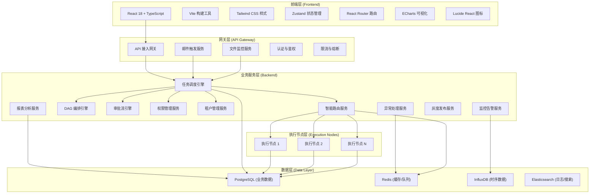
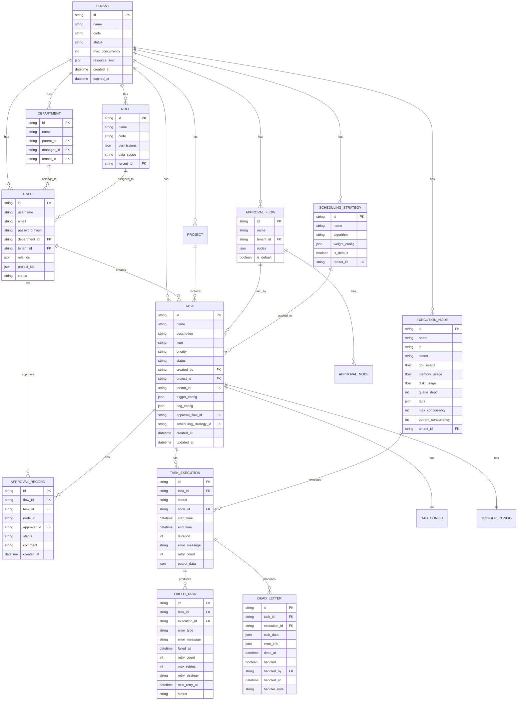

## 1. 架构设计



## 2. 技术描述

### 2.1 前端技术栈
- **框架**：React@18.2.0 + TypeScript@5.3.0
- **构建工具**：Vite@5.0.0
- **样式方案**：TailwindCSS@3.4.0 + CSS Variables
- **状态管理**：Zustand@4.4.0
- **路由管理**：React Router DOM@6.20.0
- **可视化**：ECharts@5.4.0
- **图标库**：Lucide React@0.294.0
- **HTTP客户端**：Axios@1.6.0
- **日期处理**：Day.js@1.11.0

### 2.2 后端技术栈
- **框架**：Express@4.18.2
- **语言**：TypeScript@5.3.0
- **运行时**：Node.js@20.x
- **ORM**：Prisma@5.7.0
- **认证**：JWT + bcryptjs
- **队列**：BullMQ@5.1.0
- **WebSocket**：Socket.io@4.6.0
- **数据校验**：Zod@3.22.0
- **日志**：Winston@3.11.0

### 2.3 数据库与存储
- **关系型数据库**：SQLite@3.44.0 (开发环境)
- **缓存/消息队列**：Redis Mock (开发环境)
- **数据持久化**：Prisma ORM + SQLite

### 2.4 项目初始化工具
- 使用 `vite-init` 脚手架初始化项目
- 模板选择：`react-express-ts` (React + Express + TypeScript)

## 3. 路由定义

| 路由路径 | 页面/接口类型 | 功能说明 |
|----------|--------------|----------|
| `/login` | 前端页面 | 登录页面 |
| `/` | 前端页面 | 总览仪表盘 |
| `/dashboard` | 前端页面 | 数据总览仪表盘 |
| `/tasks` | 前端页面 | 任务列表 |
| `/tasks/create` | 前端页面 | 创建任务 |
| `/tasks/:id` | 前端页面 | 任务详情 |
| `/tasks/editor` | 前端页面 | DAG可视化编排器 |
| `/scheduling` | 前端页面 | 调度策略管理 |
| `/scheduling/nodes` | 前端页面 | 执行节点管理 |
| `/scheduling/scaling` | 前端页面 | 动态扩缩容配置 |
| `/approvals` | 前端页面 | 我的待办审批 |
| `/approvals/config` | 前端页面 | 审批流配置 |
| `/approvals/history` | 前端页面 | 审批历史记录 |
| `/monitoring` | 前端页面 | 实时资源监控 |
| `/monitoring/queues` | 前端页面 | 队列监控 |
| `/monitoring/forecast` | 前端页面 | 负载预测 |
| `/analytics` | 前端页面 | 多维分析报表 |
| `/analytics/heatmap` | 前端页面 | 资源热力图 |
| `/analytics/cost` | 前端页面 | 成本归集分析 |
| `/analytics/dashboard` | 前端页面 | 自定义看板 |
| `/exceptions` | 前端页面 | 异常处理中心 |
| `/exceptions/retry` | 前端页面 | 重试任务管理 |
| `/exceptions/dead-letter` | 前端页面 | 死信队列 |
| `/canary` | 前端页面 | 灰度发布管理 |
| `/canary/monitor` | 前端页面 | 灰度效果监控 |
| `/tenants` | 前端页面 | 租户管理 |
| `/permissions` | 前端页面 | 权限与角色管理 |
| `/permissions/org` | 前端页面 | 组织架构管理 |
| `/settings` | 前端页面 | 系统设置 |
| `/settings/api` | 前端页面 | API密钥管理 |
| `/settings/audit` | 前端页面 | 审计日志 |

## 4. API 定义

### 4.1 通用响应结构

```typescript
interface ApiResponse<T = any> {
  code: number;
  message: string;
  data: T;
  timestamp: number;
}

interface PageResponse<T> {
  list: T[];
  total: number;
  page: number;
  pageSize: number;
}
```

### 4.2 任务相关接口

```typescript
// 任务基本类型
interface Task {
  id: string;
  name: string;
  description: string;
  type: 'api' | 'email' | 'file' | 'manual';
  priority: 'low' | 'medium' | 'high' | 'urgent';
  status: 'draft' | 'pending_approval' | 'active' | 'paused' | 'disabled';
  triggerConfig: TriggerConfig;
  dagConfig: DagConfig;
  approvalFlow: ApprovalFlow;
  createdAt: string;
  updatedAt: string;
  createdBy: string;
  projectId: string;
  tenantId: string;
}

interface TriggerConfig {
  type: 'api' | 'email' | 'file' | 'cron' | 'manual';
  cronExpression?: string;
  emailRules?: EmailRule[];
  fileRules?: FileRule[];
}

interface DagConfig {
  nodes: DagNode[];
  edges: DagEdge[];
}

interface DagNode {
  id: string;
  name: string;
  type: 'task' | 'condition' | 'loop' | 'start' | 'end';
  config: NodeConfig;
}

interface DagEdge {
  source: string;
  target: string;
  condition?: string;
}

// 任务列表 GET /api/tasks
interface TaskListRequest {
  page: number;
  pageSize: number;
  status?: string;
  type?: string;
  priority?: string;
  keyword?: string;
}

// 创建任务 POST /api/tasks
type TaskCreateRequest = Omit<Task, 'id' | 'createdAt' | 'updatedAt' | 'status'>;

// 任务详情 GET /api/tasks/:id
type TaskDetailResponse = Task;

// 任务执行记录
interface TaskExecution {
  id: string;
  taskId: string;
  status: 'pending' | 'running' | 'success' | 'failed' | 'cancelled';
  startTime: string;
  endTime?: string;
  duration?: number;
  nodeId?: string;
  errorMessage?: string;
  retryCount: number;
}
```

### 4.3 调度相关接口

```typescript
// 执行节点
interface ExecutionNode {
  id: string;
  name: string;
  ip: string;
  status: 'online' | 'offline' | 'maintenance';
  cpuUsage: number;
  memoryUsage: number;
  diskUsage: number;
  loadAverage: number[];
  queueDepth: number;
  tags: string[];
  maxConcurrency: number;
  currentConcurrency: number;
  tenantId?: string;
}

// 调度策略
interface SchedulingStrategy {
  id: string;
  name: string;
  algorithm: 'round_robin' | 'least_load' | 'priority_based' | 'tag_match';
  weightConfig: WeightConfig;
  isDefault: boolean;
  tenantId?: string;
}

interface WeightConfig {
  cpu: number;
  memory: number;
  queue: number;
  priority: number;
}

// 动态扩缩容规则
interface ScalingRule {
  id: string;
  name: string;
  metric: 'cpu' | 'memory' | 'queue' | 'custom';
  threshold: number;
  scaleUpThreshold: number;
  scaleDownThreshold: number;
  minNodes: number;
  maxNodes: number;
  cooldownPeriod: number;
  enabled: boolean;
}
```

### 4.4 审批流接口

```typescript
interface ApprovalFlow {
  id: string;
  taskId?: string;
  name: string;
  nodes: ApprovalNode[];
  isDefault: boolean;
}

interface ApprovalNode {
  id: string;
  name: string;
  type: 'sequential' | 'countersign' | 'or_sign';
  approvers: string[];
  timeout: number;
  autoTransferTo?: string;
  order: number;
}

interface ApprovalRecord {
  id: string;
  flowId: string;
  nodeId: string;
  taskId: string;
  approverId: string;
  status: 'approved' | 'rejected' | 'transferred' | 'pending';
  comment?: string;
  createdAt: string;
}

// 待办审批列表 GET /api/approvals/pending
interface PendingApproval {
  id: string;
  taskName: string;
  taskType: string;
  submitter: string;
  submitTime: string;
  nodeName: string;
  deadline: string;
}
```

### 4.5 监控相关接口

```typescript
// 实时监控数据
interface RealtimeMetrics {
  timestamp: number;
  nodes: NodeMetrics[];
  queues: QueueMetrics[];
}

interface NodeMetrics {
  nodeId: string;
  cpuUsage: number;
  memoryUsage: number;
  diskUsage: number;
  networkIn: number;
  networkOut: number;
  loadAverage: number[];
}

interface QueueMetrics {
  queueName: string;
  depth: number;
  waitingTime: number;
  consumeRate: number;
  produceRate: number;
}

// 负载预测数据
interface LoadForecast {
  timestamps: number[];
  predictedCpu: number[];
  predictedMemory: number[];
  predictedQueue: number[];
  confidence: number[];
}
```

### 4.6 权限与租户接口

```typescript
interface Tenant {
  id: string;
  name: string;
  code: string;
  status: 'active' | 'disabled' | 'expired';
  maxConcurrency: number;
  resourceLimit: ResourceLimit;
  createdAt: string;
  expiredAt?: string;
}

interface ResourceLimit {
  cpuCores: number;
  memoryGB: number;
  storageGB: number;
  maxTasks: number;
}

interface Role {
  id: string;
  name: string;
  code: string;
  permissions: string[];
  dataScope: 'self' | 'department' | 'project' | 'all';
  tenantId: string;
}

interface User {
  id: string;
  username: string;
  email: string;
  departmentId: string;
  roleIds: string[];
  projectIds: string[];
  tenantId: string;
  status: 'active' | 'disabled';
}

interface Department {
  id: string;
  name: string;
  parentId: string | null;
  managerId: string | null;
  tenantId: string;
  children?: Department[];
}
```

### 4.7 异常处理接口

```typescript
interface FailedTask {
  id: string;
  taskId: string;
  executionId: string;
  taskName: string;
  errorType: string;
  errorMessage: string;
  failedAt: string;
  retryCount: number;
  maxRetries: number;
  retryStrategy: 'fixed' | 'exponential' | 'linear';
  nextRetryAt?: string;
  status: 'pending_retry' | 'retrying' | 'dead_letter' | 'manual';
}

interface DeadLetter {
  id: string;
  taskId: string;
  executionId: string;
  taskData: any;
  errorInfo: ErrorInfo;
  deadAt: string;
  handled: boolean;
  handledBy?: string;
  handledAt?: string;
  handlerNote?: string;
}

interface RetryConfig {
  maxRetries: number;
  strategy: 'fixed' | 'exponential' | 'linear';
  initialDelay: number;
  multiplier: number;
  maxDelay: number;
}
```

## 5. 服务器架构图

```mermaid
graph TB
    subgraph "路由层 (Routes)"
        R1["auth.routes.ts"]
        R2["tasks.routes.ts"]
        R3["scheduling.routes.ts"]
        R4["approvals.routes.ts"]
        R5["monitoring.routes.ts"]
        R6["analytics.routes.ts"]
        R7["tenants.routes.ts"]
        R8["exceptions.routes.ts"]
    end

    subgraph "控制层 (Controllers)"
        C1["AuthController"]
        C2["TaskController"]
        C3["SchedulingController"]
        C4["ApprovalController"]
        C5["MonitoringController"]
        C6["AnalyticsController"]
        C7["TenantController"]
        C8["ExceptionController"]
    end

    subgraph "服务层 (Services)"
        S1["AuthService"]
        S2["TaskService"]
        S3["SchedulingService"]
        S4["RoutingService"]
        S5["DagEngineService"]
        S6["ApprovalService"]
        S7["MonitoringService"]
        S8["AnalyticsService"]
        S9["TenantService"]
        S10["PermissionService"]
        S11["ExceptionService"]
        S12["ScalingService"]
        S13["CanaryService"]
    end

    subgraph "数据访问层 (Repositories)"
        PR1["TaskRepository"]
        PR2["ExecutionRepository"]
        PR3["NodeRepository"]
        PR4["ApprovalRepository"]
        PR5["TenantRepository"]
        PR6["UserRepository"]
        PR7["MetricsRepository"]
        PR8["LogRepository"]
    end

    subgraph "数据库 (Database)"
        DB1["SQLite (Prisma)"]
    end

    subgraph "消息队列 (Queue)"
        Q1["BullMQ (Redis)"]
    end

    R1 --> C1
    R2 --> C2
    R3 --> C3
    R4 --> C4
    R5 --> C5
    R6 --> C6
    R7 --> C7
    R8 --> C8
    
    C1 --> S1
    C2 --> S2
    C2 --> S5
    C3 --> S3
    C3 --> S4
    C3 --> S12
    C4 --> S6
    C5 --> S7
    C6 --> S8
    C7 --> S9
    C7 --> S10
    C8 --> S11
    
    S1 --> PR6
    S2 --> PR1
    S3 --> PR3
    S4 --> PR3
    S5 --> PR1
    S5 --> PR2
    S6 --> PR4
    S7 --> PR7
    S8 --> PR7
    S9 --> PR5
    S10 --> PR6
    S11 --> PR2
    S12 --> PR3
    S13 --> PR1
    
    PR1 --> DB1
    PR2 --> DB1
    PR3 --> DB1
    PR4 --> DB1
    PR5 --> DB1
    PR6 --> DB1
    PR7 --> DB1
    PR8 --> DB1
    
    S3 --> Q1
    S4 --> Q1
    S11 --> Q1
```



## 6. 数据模型

### 6.1 实体关系图



### 6.2 数据定义语言 (DDL)

```sql
-- 租户表
CREATE TABLE tenants (
    id TEXT PRIMARY KEY,
    name TEXT NOT NULL,
    code TEXT UNIQUE NOT NULL,
    status TEXT NOT NULL DEFAULT 'active',
    max_concurrency INTEGER NOT NULL DEFAULT 100,
    resource_limit JSONB NOT NULL,
    created_at TIMESTAMP NOT NULL DEFAULT CURRENT_TIMESTAMP,
    expired_at TIMESTAMP
);

-- 部门表
CREATE TABLE departments (
    id TEXT PRIMARY KEY,
    name TEXT NOT NULL,
    parent_id TEXT,
    manager_id TEXT,
    tenant_id TEXT NOT NULL REFERENCES tenants(id),
    FOREIGN KEY (parent_id) REFERENCES departments(id)
);

-- 角色表
CREATE TABLE roles (
    id TEXT PRIMARY KEY,
    name TEXT NOT NULL,
    code TEXT NOT NULL,
    permissions JSONB NOT NULL,
    data_scope TEXT NOT NULL DEFAULT 'self',
    tenant_id TEXT NOT NULL REFERENCES tenants(id)
);

-- 用户表
CREATE TABLE users (
    id TEXT PRIMARY KEY,
    username TEXT NOT NULL UNIQUE,
    email TEXT NOT NULL UNIQUE,
    password_hash TEXT NOT NULL,
    department_id TEXT REFERENCES departments(id),
    tenant_id TEXT NOT NULL REFERENCES tenants(id),
    role_ids JSONB NOT NULL,
    project_ids JSONB NOT NULL,
    status TEXT NOT NULL DEFAULT 'active',
    created_at TIMESTAMP NOT NULL DEFAULT CURRENT_TIMESTAMP
);

-- 项目表
CREATE TABLE projects (
    id TEXT PRIMARY KEY,
    name TEXT NOT NULL,
    description TEXT,
    owner_id TEXT NOT NULL REFERENCES users(id),
    tenant_id TEXT NOT NULL REFERENCES tenants(id),
    created_at TIMESTAMP NOT NULL DEFAULT CURRENT_TIMESTAMP
);

-- 审批流表
CREATE TABLE approval_flows (
    id TEXT PRIMARY KEY,
    name TEXT NOT NULL,
    tenant_id TEXT NOT NULL REFERENCES tenants(id),
    nodes JSONB NOT NULL,
    is_default BOOLEAN NOT NULL DEFAULT false
);

-- 调度策略表
CREATE TABLE scheduling_strategies (
    id TEXT PRIMARY KEY,
    name TEXT NOT NULL,
    algorithm TEXT NOT NULL,
    weight_config JSONB NOT NULL,
    is_default BOOLEAN NOT NULL DEFAULT false,
    tenant_id TEXT REFERENCES tenants(id)
);

-- 任务表
CREATE TABLE tasks (
    id TEXT PRIMARY KEY,
    name TEXT NOT NULL,
    description TEXT,
    type TEXT NOT NULL,
    priority TEXT NOT NULL DEFAULT 'medium',
    status TEXT NOT NULL DEFAULT 'draft',
    created_by TEXT NOT NULL REFERENCES users(id),
    project_id TEXT REFERENCES projects(id),
    tenant_id TEXT NOT NULL REFERENCES tenants(id),
    trigger_config JSONB NOT NULL,
    dag_config JSONB NOT NULL,
    approval_flow_id TEXT REFERENCES approval_flows(id),
    scheduling_strategy_id TEXT REFERENCES scheduling_strategies(id),
    created_at TIMESTAMP NOT NULL DEFAULT CURRENT_TIMESTAMP,
    updated_at TIMESTAMP NOT NULL DEFAULT CURRENT_TIMESTAMP
);

-- 执行节点表
CREATE TABLE execution_nodes (
    id TEXT PRIMARY KEY,
    name TEXT NOT NULL,
    ip TEXT NOT NULL,
    status TEXT NOT NULL DEFAULT 'offline',
    cpu_usage REAL NOT NULL DEFAULT 0,
    memory_usage REAL NOT NULL DEFAULT 0,
    disk_usage REAL NOT NULL DEFAULT 0,
    queue_depth INTEGER NOT NULL DEFAULT 0,
    tags JSONB NOT NULL,
    max_concurrency INTEGER NOT NULL DEFAULT 10,
    current_concurrency INTEGER NOT NULL DEFAULT 0,
    tenant_id TEXT REFERENCES tenants(id),
    last_heartbeat TIMESTAMP NOT NULL DEFAULT CURRENT_TIMESTAMP
);

-- 任务执行记录表
CREATE TABLE task_executions (
    id TEXT PRIMARY KEY,
    task_id TEXT NOT NULL REFERENCES tasks(id),
    status TEXT NOT NULL DEFAULT 'pending',
    node_id TEXT REFERENCES execution_nodes(id),
    start_time TIMESTAMP NOT NULL,
    end_time TIMESTAMP,
    duration INTEGER,
    error_message TEXT,
    retry_count INTEGER NOT NULL DEFAULT 0,
    output_data JSONB,
    created_at TIMESTAMP NOT NULL DEFAULT CURRENT_TIMESTAMP
);

-- 审批记录表
CREATE TABLE approval_records (
    id TEXT PRIMARY KEY,
    flow_id TEXT NOT NULL REFERENCES approval_flows(id),
    task_id TEXT NOT NULL REFERENCES tasks(id),
    node_id TEXT NOT NULL,
    approver_id TEXT NOT NULL REFERENCES users(id),
    status TEXT NOT NULL DEFAULT 'pending',
    comment TEXT,
    created_at TIMESTAMP NOT NULL DEFAULT CURRENT_TIMESTAMP
);

-- 失败任务表
CREATE TABLE failed_tasks (
    id TEXT PRIMARY KEY,
    task_id TEXT NOT NULL REFERENCES tasks(id),
    execution_id TEXT NOT NULL REFERENCES task_executions(id),
    task_name TEXT NOT NULL,
    error_type TEXT NOT NULL,
    error_message TEXT NOT NULL,
    failed_at TIMESTAMP NOT NULL DEFAULT CURRENT_TIMESTAMP,
    retry_count INTEGER NOT NULL DEFAULT 0,
    max_retries INTEGER NOT NULL DEFAULT 3,
    retry_strategy TEXT NOT NULL DEFAULT 'exponential',
    next_retry_at TIMESTAMP,
    status TEXT NOT NULL DEFAULT 'pending_retry'
);

-- 死信队列表
CREATE TABLE dead_letters (
    id TEXT PRIMARY KEY,
    task_id TEXT NOT NULL REFERENCES tasks(id),
    execution_id TEXT NOT NULL REFERENCES task_executions(id),
    task_data JSONB NOT NULL,
    error_info JSONB NOT NULL,
    dead_at TIMESTAMP NOT NULL DEFAULT CURRENT_TIMESTAMP,
    handled BOOLEAN NOT NULL DEFAULT false,
    handled_by TEXT REFERENCES users(id),
    handled_at TIMESTAMP,
    handler_note TEXT
);

-- 指标时序表
CREATE TABLE metrics (
    id TEXT PRIMARY KEY,
    node_id TEXT REFERENCES execution_nodes(id),
    metric_type TEXT NOT NULL,
    value REAL NOT NULL,
    timestamp TIMESTAMP NOT NULL DEFAULT CURRENT_TIMESTAMP,
    tenant_id TEXT REFERENCES tenants(id)
);

-- 审计日志表
CREATE TABLE audit_logs (
    id TEXT PRIMARY KEY,
    user_id TEXT REFERENCES users(id),
    action TEXT NOT NULL,
    resource_type TEXT NOT NULL,
    resource_id TEXT NOT NULL,
    old_value JSONB,
    new_value JSONB,
    ip_address TEXT,
    user_agent TEXT,
    created_at TIMESTAMP NOT NULL DEFAULT CURRENT_TIMESTAMP,
    tenant_id TEXT REFERENCES tenants(id)
);

-- 灰度发布策略表
CREATE TABLE canary_strategies (
    id TEXT PRIMARY KEY,
    name TEXT NOT NULL,
    description TEXT,
    scheduling_strategy_id TEXT NOT NULL REFERENCES scheduling_strategies(id),
    traffic_percentage INTEGER NOT NULL DEFAULT 10,
    target_users JSONB,
    target_tags JSONB,
    start_time TIMESTAMP,
    end_time TIMESTAMP,
    status TEXT NOT NULL DEFAULT 'draft',
    metrics JSONB,
    created_by TEXT NOT NULL REFERENCES users(id),
    tenant_id TEXT NOT NULL REFERENCES tenants(id),
    created_at TIMESTAMP NOT NULL DEFAULT CURRENT_TIMESTAMP
);

-- 创建索引
CREATE INDEX idx_tasks_tenant ON tasks(tenant_id);
CREATE INDEX idx_tasks_status ON tasks(status);
CREATE INDEX idx_tasks_project ON tasks(project_id);
CREATE INDEX idx_executions_task ON task_executions(task_id);
CREATE INDEX idx_executions_status ON task_executions(status);
CREATE INDEX idx_executions_node ON task_executions(node_id);
CREATE INDEX idx_metrics_timestamp ON metrics(timestamp);
CREATE INDEX idx_metrics_node ON metrics(node_id);
CREATE INDEX idx_audit_user ON audit_logs(user_id);
CREATE INDEX idx_audit_timestamp ON audit_logs(created_at);
CREATE INDEX idx_failed_tasks_status ON failed_tasks(status);
CREATE INDEX idx_nodes_tenant ON execution_nodes(tenant_id);
CREATE INDEX idx_nodes_status ON execution_nodes(status);
```
